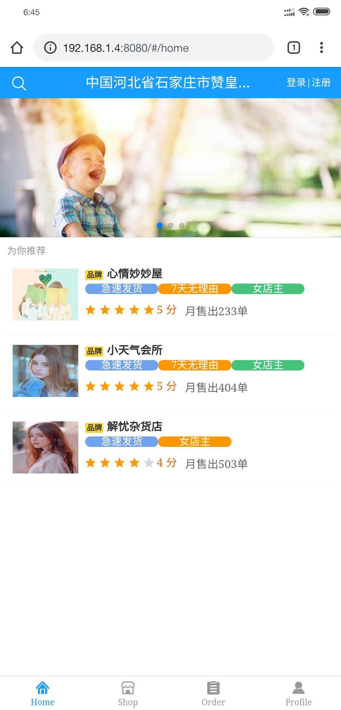
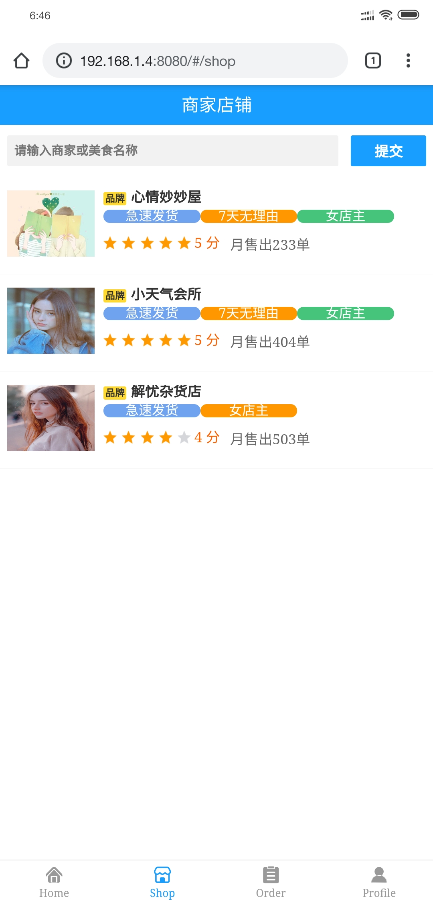
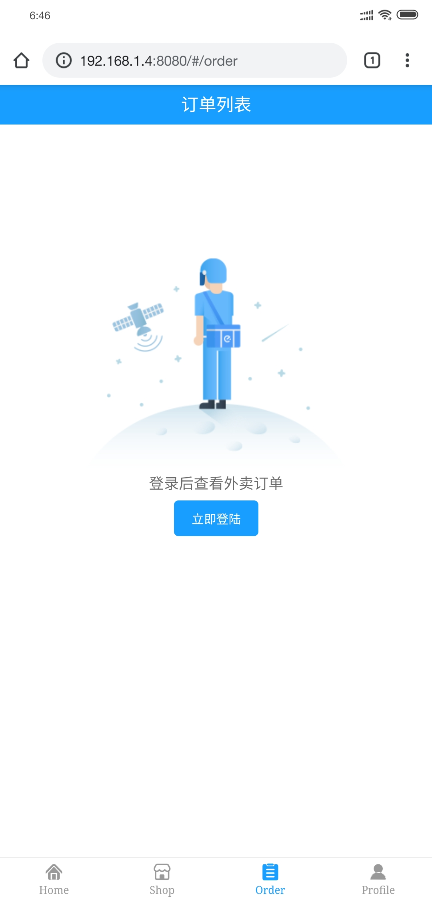
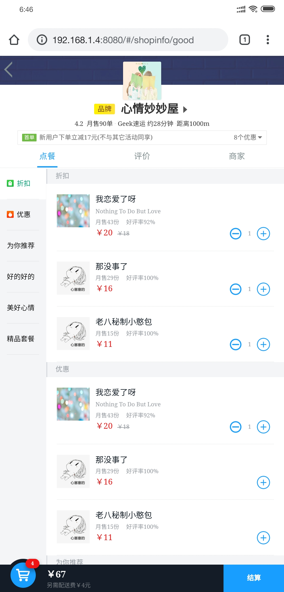
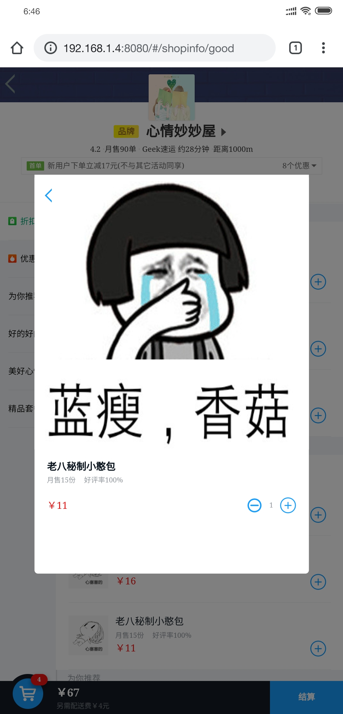
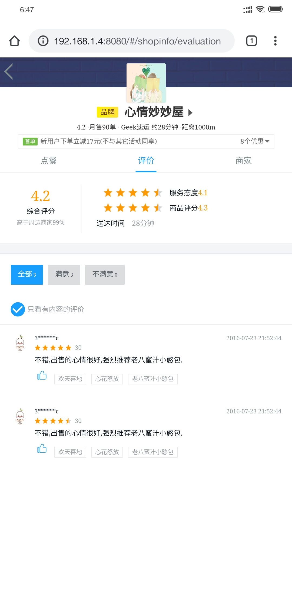

# DIYShop

本项目需要搭配后台项目使用,后台项目地址[DIYShop-Backend](https://github.com/LittleControl/DIYShop-BackEnd)

## 环境要求

- Node.js
- Yarn

## 启动前准备

修改[src/api/index.js](https://github.com/LittleControl/DIYShop/blob/master/src/api/index.js)的中的`POST_URL`和[vue.config.js](https://github.com/LittleControl/DIYShop/blob/master/vue.config.js)中的`/api/target`为你后端项目的地址

## 启动项目

- `yarn install`
- `yarn run serve` or `npm run serve`

## 实现的功能

- 简单的用户登录注册
- 异步获取店铺列表
- 异步搜索店铺信息
- 店铺详情,商品列表,评价,商家信息
- 超级丝滑的滑动(Better-Scroll真NM好用)
- 不包含`credentials:true`的所有域名的跨域请求

## 未实现的功能

- 订单的功能
- 用户详情界面
- Profile界面的各种功能
- Session和Cookie(怪我太懒了)

## 目前已知的BUG(其实是我自己懒)

- 只有在主界面刷新才会获得数据,在其他页面不会发起Ajax请求,会因为没有获取数据报错
- 当登录后,订单还是会提示未登录
- 购物车的数量与食物图片详情显式数据不同步,应该是我代码逻辑的问题,再加上可能是Vuex的一些BUG

## 项目截图

